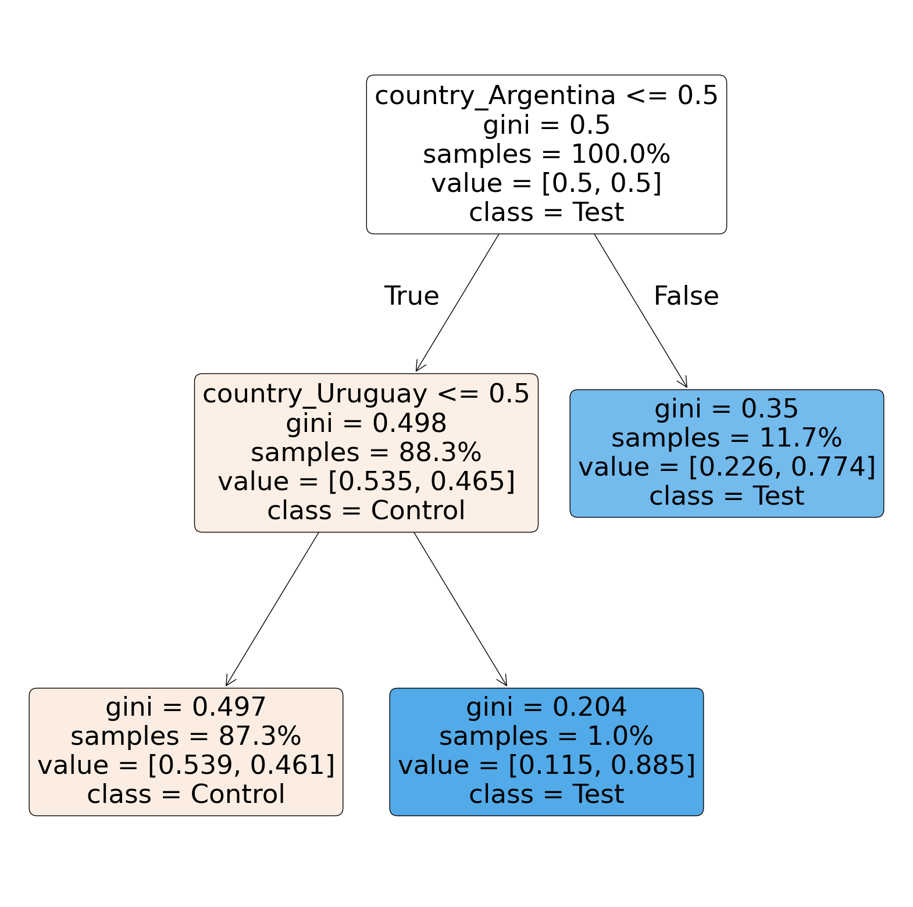
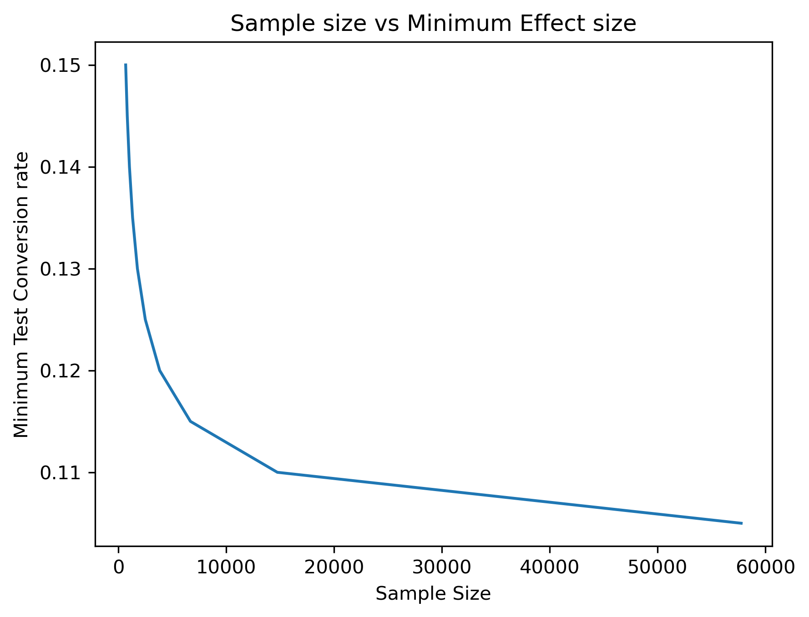

# A/B Test Analysis: Site Conversion Optimization

**Duration:** June 2024  
**Tools Used:** Python, Pandas, SciPy, Scikit-learn, Matplotlib, StatsModels, Graphviz  

## Overview

This project evaluated the integrity and effectiveness of an A/B test aimed at increasing user conversion rates by deploying a new site version. It applied statistical testing, ML-driven diagnostics, and power analysis to ensure validity and guide rollout decisions.

---

## Key Insights

### Conversion Impact
- **Control Conversion Rate:** 4.37%  
- **Test Conversion Rate:** 5.56%  
- **Welch’s T-Test Result:** p-value = 1.32e-14 → **Statistically significant**  

### Randomization Bias Detected
- Decision tree classification and feature analysis revealed Argentina and Uruguay were **overrepresented in the test group**, violating randomization assumptions:
  - 🇦🇷 Argentina: 17% (test) vs 5% (control)
  - 🇺🇾 Uruguay: 1.7% (test) vs 0.2% (control)

### Correction Strategy
- **Oversampled underrepresented users** from test to augment the control group and rebalance country distributions.
- Post-correction t-test: **p = 0.2545** → **No statistically significant difference** → Original uplift was likely confounded by demographic bias.

### Power Analysis
- **Required sample size per group:** ~14,744 to detect a 1% lift in conversion with 80% power and 5% significance.
- Created sensitivity chart showing how sample size changes with different expected uplifts.

  
*Decision tree showing country-level imbalance*

  
*Sample size needed for varying target conversion rates*

---

## Conclusion

Initial uplift in conversion was driven by flawed randomization. After correction, the new site version did **not** produce a statistically significant improvement. The project highlights the importance of validating A/B test assumptions before acting on results.

---
